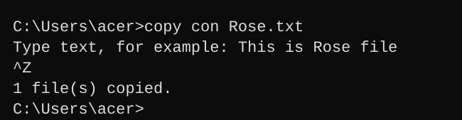
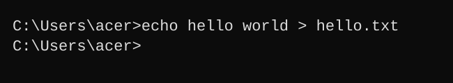
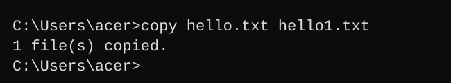
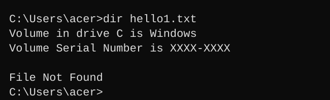
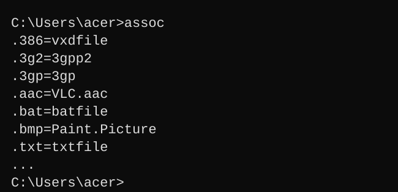
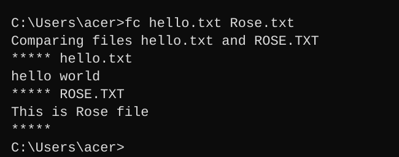
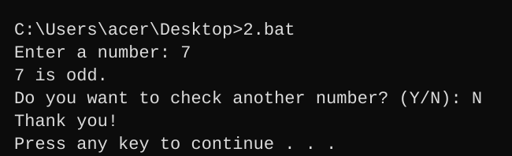
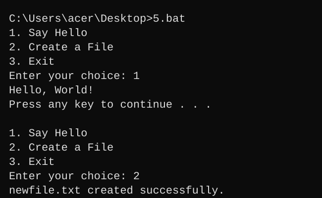

# Windows-basic-commands-batchscript
Ex08-Windows-basic-commands-batchscript

# AIM:
To execute Windows basic commands and batch scripting

# DESIGN STEPS:

### Step 1:
Navigate to any Windows environment installed on the system or installed inside a virtual environment like VirtualBox/VMware.

### Step 2:
Write the Windows commands / batch file. Save each script in a file with a .bat extension. Ensure you have the necessary permissions to perform the operations. Adapt paths as needed based on your system configuration.

### Step 3:
Execute the necessary commands/batch file for the desired output.

# WINDOWS COMMANDS:

## Exercise 1: Basic Directory and File Operations

### Create a directory named "my-folder"

**COMMAND**
```cmd
mkdir my-folder
```

**OUTPUT**


### Remove the directory "my-folder"

**COMMAND**
```cmd
rmdir my-folder
```

**OUTPUT**


### Create the file Rose.txt

**COMMAND**
```cmd
copy con Rose.txt
```
Type some text, press **Enter**, then press **Ctrl+Z** and **Enter** to save.

**OUTPUT**



### Create the file hello.txt using echo and redirection

**COMMAND**
```cmd
echo hello world > hello.txt
```

**OUTPUT**



### Copy the file hello.txt into the file hello1.txt

**COMMAND**
```cmd
copy hello.txt hello1.txt
```

**OUTPUT**



### Remove the file hello1.txt

**COMMAND**
```cmd
del hello1.txt
```

**OUTPUT**


### List out the file hello1.txt in the current directory

**COMMAND**
```cmd
dir hello1.txt
```

**OUTPUT**



### List out all the associated file extensions

**COMMAND**
```cmd
assoc
```

**OUTPUT**



### Compare the file hello.txt and rose.txt

**COMMAND**
```cmd
fc hello.txt Rose.txt
```

**OUTPUT**



# Exercise 2: Advanced Batch Scripting

## 1. Batch file with a variable and greeting

Create a batch file on the desktop, for example `1.bat`.

**SCRIPT**
```bat
@echo off
set name=John
echo Hello, %name%
pause
```

**OUTPUT**


## 2. Batch file to check whether a number is odd

Create a batch file on the desktop, for example `2.bat`.

**SCRIPT**
```bat
@echo off
:loop
set /p num=Enter a number: 
set /a rem=num%%2

if %rem%==1 (
    echo %num% is odd.
) else (
    echo %num% is not odd.
)

:choice
set /p again=Do you want to check another number? (Y/N): 
if /I "%again%"=="Y" goto loop
if /I "%again%"=="N" (
    echo Thank you!
    pause
    exit /b
)
echo Invalid input. Please enter Y or N.
goto choice
```

**OUTPUT**



## 3. FOR loop from 1 to 5

Create a batch file on the desktop, for example `3.bat`.

**SCRIPT**
```bat
@echo off
for %%i in (1 2 3 4 5) do echo Number: %%i
pause
```

**OUTPUT**


## 4. Check whether sample.txt exists

Create a batch file on the desktop, for example `4.bat`.

**SCRIPT**
```bat
@echo off
if exist sample.txt (
    echo sample.txt exists.
) else (
    echo sample.txt does not exist.
)
pause
```

**OUTPUT**


## 5. Simple menu using goto

Create a batch file on the desktop, for example `5.bat`.

**SCRIPT**
```bat
@echo off

:menu
cls
echo 1. Say Hello
echo 2. Create a File
echo 3. Exit
set /p choice=Enter your choice: 

if "%choice%"=="1" goto hello
if "%choice%"=="2" goto create
if "%choice%"=="3" goto exit

echo Invalid choice.
pause
goto menu

:hello
echo Hello, World!
pause
goto menu

:create
echo This is a new file > newfile.txt
echo newfile.txt created successfully.
pause
goto menu

:exit
echo Goodbye!
pause
exit /b
```

**OUTPUT**



# RESULT:
The commands/batch files are executed successfully.
